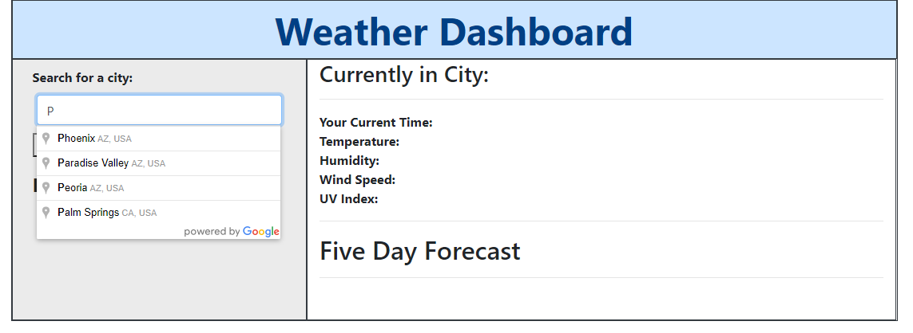
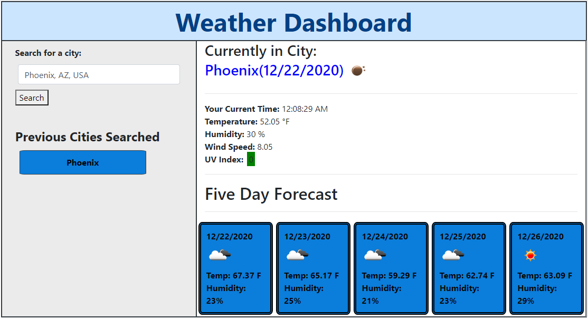
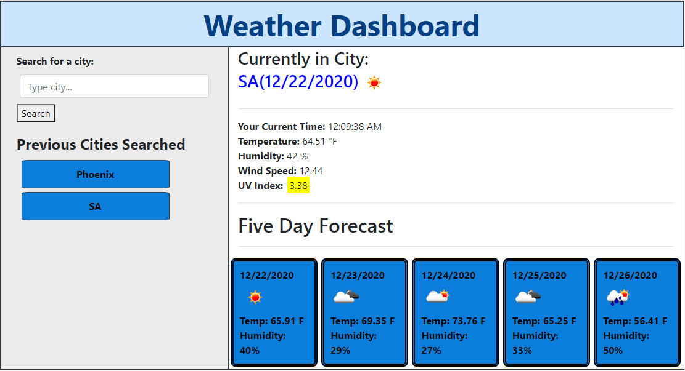

# Skye Lucking - 06 Weather Dashboard (with City Autocomplete)

<h1>Description of application</h1>
A weather dashboard that allows you to search for a city (included an autocomplete API to help you with that) and then get recent weather data. It also saves your past searches so you may review them later. 

 
 Enjoy!

 

<h1>Screenshot</h1>
 
 
 

<h1>Link to the deployed application</h1>
<a href="https://skyelucking.github.io/06-Weather-Dashboard/">https://skyelucking.github.io/06-Weather-Dashboard/</a>

<h1>Link to GitHub Repo</h1>
<a href="https://github.com/skyelucking/06-Weather-Dashboard">https://github.com/skyelucking/06-Weather-Dashboard</a>

<h1>Now here is your joke...</h1>  
What do you call a computer superhero?
 
 
 
<em>A screensaver</em>
